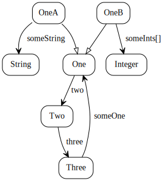
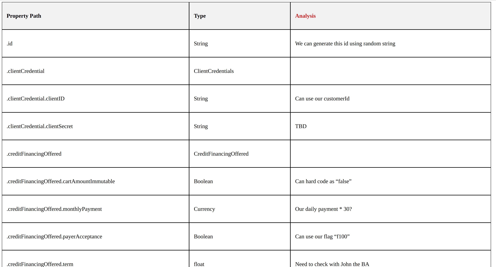

# bean-model-graph

## What is it

From a javabean class, this java tool can build a property dependency graph (as in graph theory)  

For example, for classes like
```java
public interface One {
    Two getTwo();
}

public abstract class OneA implements One {
    public String getSomeString() {
        return null;
    }
}

public abstract class OneB implements One {
    public List<Integer> getSomeInts() {
        return null;
    }
}

public class Two {
    private Three three;
}

public class Three {
    private One getSomeOne() {
        return null;
    }
}

```

You can get a graph [data structure](./graph-constructor/src/main/java/org/beanmodelgraph/constructor/model/BmgGraph.java), which can be visualized like



## How can it help me? 

One usage is to use it help analyze an API's data structure, by putting all properties of related beans in tabular format.

For example: 




## Usage

### Build the graph first

Click [this](https://search.maven.org/artifact/com.github.chenjianjx.beanmodelgraph/graph-drawer) to find the latest version, and add it to your project with maven or gradle.

Then, 

```java

 BeanModelGraphConstructor graphConstructor = new BeanModelGraphConstructor(
                YourRootBean.class,
                "your.package.to.scan.sub.types",  // bean-model-graph will bring a bean's subclasses to the graph.
                                                   // Here define the subclass scan scope
                param.getAdditionalAtomicTypes()); // An atomic type's properties won't be in the graph, 
                                                   // For example, there may be no point to inspect the properties of 'Currency'
 BmgGraph bmgGraph = graphConstructor.construct();
 
```

To help you traverse this graph, a DFS traverser [BmgDfsTraverser](./graph-constructor/src/main/java/org/beanmodelgraph/constructor/traverse/BmgDfsTraverser.java) is provided. You just need to implement a listener.

### Render the graph  as a table for properties

#### First, convert the graph to a data structure of a list of rows

Click [this](https://search.maven.org/artifact/com.github.chenjianjx.beanmodelgraph/graph-tabulizer) to find the latest version.

```java
BeanModelGraphTabulizer graphTabulizer = new BeanModelGraphTabulizer();
List<BmgRow> rows = graphTabulizer.toRows(bmgGraph);
```

#### Then render these rows

With a list of `BmgRow`, you can render it any way you want. For example, use a template engine.

One recommendation is [ssio](https://github.com/chenjianjx/ssio), which can let you create a spreadsheet in a few lines of code. 

Example of using [ssio-ext-html-table](https://github.com/chenjianjx/ssio/tree/master/ssio-ext-html-table) : 

```java

import org.beanmodelgraph.tabulizer.model.BmgRow;
import org.ssio.api.interfaces.annotation.SsColumn;

//Create a data structure ssio needed
public class BmgRowViewObject {

    @SsColumn(index = 0)
    private String propertyPath;

    @SsColumn(index = 1, name = "Type")
    private String typeSimpleName;

    public static BmgRowViewObject fromBmgRow(BmgRow bo) {
        BmgRowViewObject vo = new BmgRowViewObject();
        vo.propertyPath = bo.getPathAsString();
        vo.typeSimpleName = bo.getType().getSimpleName();
        return vo;
    }
    //...
}    
```

```java
List<BmgRowViewObject> viewObjects = rows.stream().map(BmgRowViewObject::fromBmgRow).collect(Collectors.toList());
HtmlTableSsioTemplate.defaultInstance().toHtmlPage(viewObjects, BmgRowViewObject.class, outputFile, "utf8", false);
```

#### Put them together
For a full example, please take a look at [BmgBuildAndTabulizeITCase](./graph-tabulizer/src/test/java/org/beanmodelgraph/tabulizer/integrationtest/cases/BmgBuildAndTabulizeITCase.java)